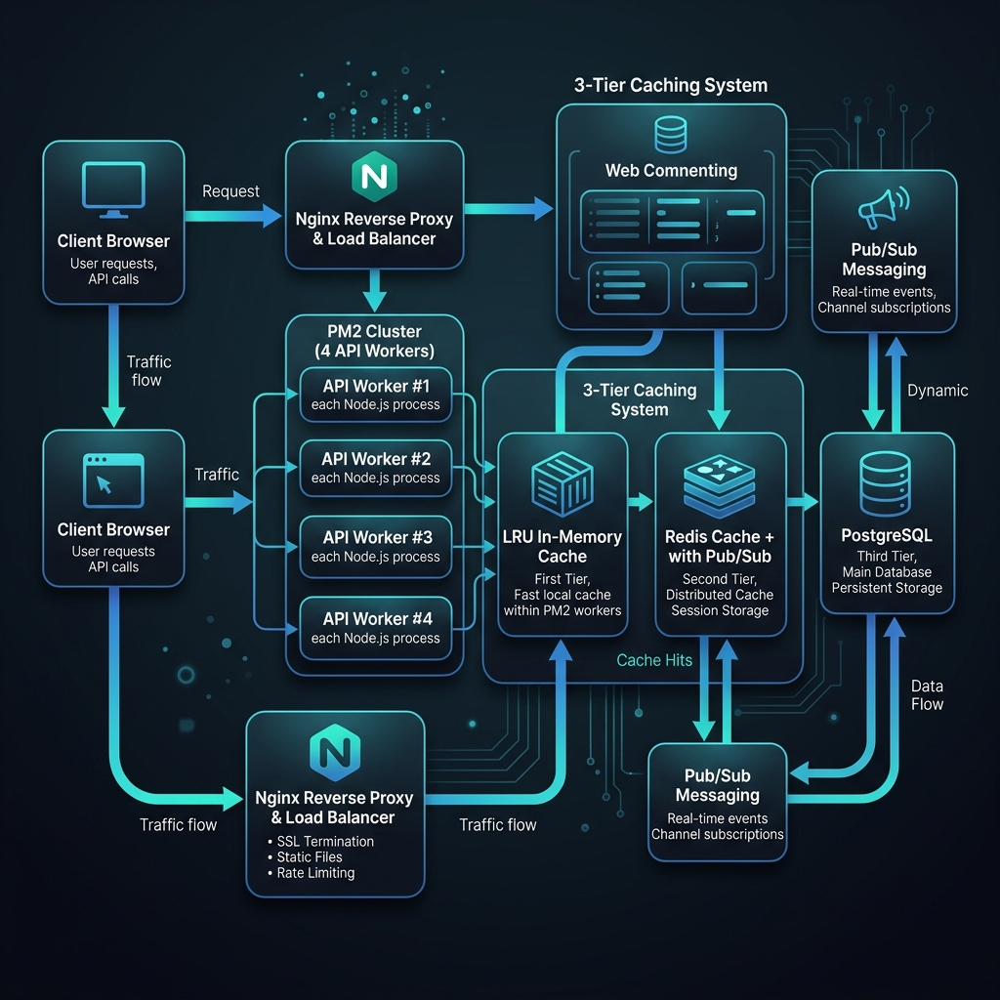
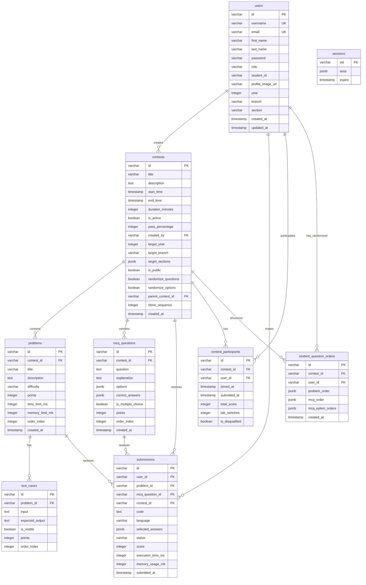

# System Design Document - Skillnox Contest Platform

## 1. Executive Summary

Skillnox is a web-based online coding contest platform designed to facilitate programming competitions for educational institutions. The system provides real-time contest management, automated code evaluation, anti-cheating mechanisms, and comprehensive analytics.

## 2. System Architecture

#### 2.1 High-Level Architecture

The platform uses a highly responsive, multi-tier web application architecture designed to support 5,000+ concurrent virtual users under peak exam conditions. 



```
                       ┌──────────────────────┐
                       │  Client Web Browser  │
                       │    (React SPA)       │
                       └──────────┬───────────┘
                                  │ HTTPS / WebSockets (Socket.IO)
                                  ▼
                       ┌──────────────────────┐
                       │  Nginx Reverse Proxy │
                       │ (SSL & Static Files) │
                       └──────────┬───────────┘
                                  │ Port 3000 Load Balancing
                                  ▼
           ┌──────────────────────────────────────────────┐
           │            PM2 Cluster Manager               │
           │  (Spawns 8/4 Clustered Node.js API Workers)  │
           └──────┬──────────────┬──────────────┬─────────┘
                  │              │              │
    ┌─────────────▼─────┐  ┌─────▼──────────┐  ┌─▼─────────────┐
    │  UltraCache (L1)  │  │  Redis Cache   │  │ PostgreSQL 12 │
    │ (In-Process LRU)  │  │   & Pub/Sub    │  │ (Drizzle ORM) │
    │  allowStale=true  │  │  (Session/L2)  │  │ (Primary DB)  │
    └───────────────────┘  └────────────────┘  └───────────────┘
```

### 2.2 Component Architecture

1.  **Frontend (Client)**: 
    *   **UI/UX**: Single Page Application built with React 18, TypeScript, Tailwind CSS, and Radix UI.
    *   **State Management**: React Query (TanStack Query) for declarative server-state management and client-side response caching.
    *   **Code Editor**: Embedded Monaco Editor for live multi-language code editing.
    *   **Real-time Services**: Socket.IO client for live leaderboard ranking updates, remaining contest timers, and async submission progress.
2.  **Backend (API & Execution Gateway)**:
    *   **Process Management**: PM2 Clustered mode running 4-8 Node.js/Express.js workers.
    *   **Routing & Controller**: Express.js APIs validated dynamically using Zod schemas.
    *   **Database Access**: Drizzle ORM providing type-safe SQL query generation over PostgreSQL 12.
    *   **In-Process Execution Limiter**: `AsyncSemaphore` class restricting concurrent compilations (up to `MAX_CONCURRENT_EXECUTIONS`) to prevent CPU starvation on the main event loop.
3.  **Data & Cache Layers**:
    *   **PostgreSQL 12**: Relational database with connection pooling (25/worker, max 300 connections) and write-optimized configurations (`synchronous_commit = off`).
    *   **Redis Cache & Pub/Sub Store**: Dedicated cache layer managing shared session states, real-time leaderboard indexes, and cross-worker cache invalidation broadcasts (`skillnox:cache:invalidate` channel).
    *   **UltraCache**: 3-Tier cache mechanism utilizing local LRU cache with Redis Pub/Sub invalidations and Singleflight DB query coalescing.

```
                                │
                                ▼
┌─────────────────────────────────────────────────────────────┐
│                   Backend (Node.js)                         │
├─────────────────────────────────────────────────────────────┤
│  API Gateway  │  Business Logic  │  Data Access  │  Auth    │
│  - Express.js │  - Contest Mgmt  │  - Drizzle ORM│  - JWT   │
│  - Middleware │  - Code Eval     │  - PostgreSQL │  - Session│
│  - Validation │  - Anti-cheat    │  - Redis Cache│  - Passport│
└─────────────────────────────────────────────────────────────┘
                                │
                                ▼
┌─────────────────────────────────────────────────────────────┐
│                    Data Layer                               │
├─────────────────────────────────────────────────────────────┤
│  Primary DB  │  Cache Layer  │  File Storage  │  External  │
│  - PostgreSQL│  - Redis      │  - Local/Cloud │  - APIs    │
│  - ACID      │  - Sessions   │  - Static Files│  - Webhooks│
│  - Relations │  - Leaderboard│  - Uploads     │  - Notifications│
└─────────────────────────────────────────────────────────────┘
```

## 3. Database Design

### 3.1 Entity Relationship Diagram



### 3.2 Database Schema Details

#### Users Table (`users`)
- **Purpose**: Store student and admin account credentials and profile info.
- **Key Fields**: `id` (PK, UUID), `username` (unique), `email` (unique), `password` (Argon2 hashed), `role` ("admin" or "student"), `studentId`, `year`, `branch`, `section`.
- **Indexes**: Composite/unique indexes on `username` and `email` for rapid lookup during authentication.

#### Contests Table (`contests`)
- **Purpose**: Configuration and targeting rules for exams.
- **Key Fields**: `id` (PK, UUID), `title`, `startTime`, `endTime`, `duration`, `passPercentage`, `targetYear`, `targetBranch`, `targetSections` (JSONB list of sections), `isPublic`, `randomizeQuestions`, `randomizeOptions`, `parentContestId` (self-referential for contest cloning), `cloneSequence`.

#### Problems Table (`problems`)
- **Purpose**: Programming questions linked to a specific contest.
- **Key Fields**: `id` (PK, UUID), `contestId` (FK), `title`, `description`, `difficulty` ("easy", "medium", "hard"), `points`, `timeLimit`, `memoryLimit`, `orderIndex`.
- **Indexes**: `idx_problems_contest` on `contest_id` to load contest tasks quickly.

#### Test Cases Table (`test_cases`)
- **Purpose**: Input inputs and expected outputs for automatic evaluation.
- **Key Fields**: `id` (PK, UUID), `problemId` (FK), `input`, `expectedOutput`, `isVisible` (true for sample test cases, false for hidden evaluation cases), `points`, `orderIndex`.
- **Indexes**: `idx_test_cases_problem` on `problem_id`.

#### MCQ Questions Table (`mcq_questions`)
- **Purpose**: Multiple-choice questions for cognitive assessments.
- **Key Fields**: `id` (PK, UUID), `contestId` (FK), `question`, `explanation` (shown after review), `options` (JSONB array of options with text), `correctAnswers` (JSONB array of correct indices), `isMultipleChoice`, `points`, `orderIndex`.
- **Indexes**: `idx_mcq_questions_contest` on `contest_id`.

#### Submissions Table (`submissions`)
- **Purpose**: Permanent log of student test responses and scores.
- **Key Fields**: `id` (PK, UUID), `userId` (FK), `problemId` (FK, nullable), `mcqQuestionId` (FK, nullable), `contestId` (FK), `code`, `language`, `selectedAnswers` (JSONB), `status` (accepted, wrong_answer, compile_error, runtime_error), `score`, `executionTime`, `memoryUsage`.
- **Indexes**: `idx_submissions_contest` on `contest_id` and `idx_submissions_user` on `user_id` for instant query response on score computations.

#### Contest Participants Table (`contest_participants`)
- **Purpose**: Exam enrollment, progress tracking, and cheat counters.
- **Key Fields**: `id` (PK, UUID), `contestId` (FK), `userId` (FK), `joinedAt`, `submittedAt` (completion time), `totalScore`, `tabSwitches` (anti-cheat tab focus loss counter), `isDisqualified`.
- **Indexes**: Composite index `idx_contest_participants_contest_user` on `(contest_id, user_id)` for high-speed participant checks during exams.

#### Student Question Orders Table (`student_question_orders`)
- **Purpose**: Persist the personalized randomized order of problems/MCQs per student to guarantee consistency across browser refreshes.
- **Key Fields**: `id` (PK, UUID), `contestId` (FK), `userId` (FK), `problemOrder` (JSONB array of randomized IDs), `mcqOrder` (JSONB array of randomized IDs), `mcqOptionOrders` (JSONB map of question ID to option indexes).
- **Indexes**: Composite index `idx_student_question_orders_contest_user` on `(contest_id, user_id)`.

## 4. API Design

### 4.1 RESTful API Endpoints

#### Authentication APIs
```
POST   /api/auth/login          # User login
POST   /api/auth/logout         # User logout
GET    /api/auth/me            # Get current user
```

#### Contest Management APIs
```
GET    /api/contests           # List all contests
POST   /api/contests           # Create new contest
GET    /api/contests/:id       # Get contest details
PUT    /api/contests/:id       # Update contest
DELETE /api/contests/:id       # Delete contest
POST   /api/contests/:id/join  # Join contest
POST   /api/contests/:id/submit # Submit contest
GET    /api/contests/:id/status # Get contest status
```

#### Problem Management APIs
```
GET    /api/problems           # List problems
POST   /api/problems           # Create problem
GET    /api/problems/:id       # Get problem details
PUT    /api/problems/:id       # Update problem
DELETE /api/problems/:id       # Delete problem
```

#### Submission APIs
```
POST   /api/submissions        # Submit code
GET    /api/submissions/user/:userId # Get user submissions
POST   /api/execute-code       # Execute code (test run)
```

#### Leaderboard APIs
```
GET    /api/contests/:id/leaderboard # Get contest leaderboard
```

### 4.2 WebSocket Events

#### Real-time Updates
```javascript
// Client to Server
socket.emit('join-contest', contestId);
socket.emit('leave-contest', contestId);

// Server to Client
socket.on('submission-update', data);
socket.on('leaderboard-update', data);
socket.on('disqualified', data);
```

### 4.3 API Response Format

#### Success Response
```json
{
  "success": true,
  "data": { ... },
  "message": "Operation successful"
}
```

#### Error Response
```json
{
  "success": false,
  "error": {
    "code": "VALIDATION_ERROR",
    "message": "Invalid input data",
    "details": { ... }
  }
}
```

## 5. Security Architecture

### 5.1 Authentication & Authorization

#### Authentication Flow
1. User submits credentials via login form
2. Server validates credentials against database
3. Server creates session and returns session ID
4. Client stores session ID in secure cookie
5. Subsequent requests include session ID for validation

#### Authorization Levels
- **Admin**: Full system access, contest management
- **Student**: Contest participation, submission access
- **Guest**: Limited read-only access

### 5.2 Anti-Cheat Mechanisms

#### Tab Switch Detection
- Monitor `visibilitychange` events
- Track `window.blur` and `pagehide` events
- Implement cooldown to prevent false positives
- Disqualify after configurable threshold

#### Fullscreen Enforcement
- Require fullscreen mode for contest participation
- Monitor fullscreen state changes
- Block access if fullscreen is exited

#### Code Execution Security
- Sandboxed code execution environment
- Time and memory limits per execution
- Input/output validation and sanitization

### 5.3 Data Protection

#### Input Validation
- Zod schema validation for all inputs
- SQL injection prevention via parameterized queries
- XSS protection through content sanitization

#### Session Security
- Secure session cookies (HttpOnly, Secure, SameSite)
- Session timeout configuration
- CSRF protection via token validation

## 6. Performance Considerations

### 6.1 Multi-Tier Caching Strategy

To support 5,000+ concurrent virtual users without DB connection starvation or thundering herd collapses, the platform implements a specialized **3-Tier Caching Architecture**:

```
[Incoming Request]
        │
        ▼
┌───────────────────────────────┐
│ L1: Process LRU Memory Cache  │ ──(Hit)──> [Return Result Instantly]
│   (allowStale=true, TTL 5m)   │
└───────────────┬───────────────┘
                │ (Miss)
                ▼
┌───────────────────────────────┐
│ L2: Shared Redis Cache Store  │ ──(Hit)──> [Populate L1 & Return]
│   (noeviction, 256MB bounds)  │
└───────────────┬───────────────┘
                │ (Miss)
                ▼
┌───────────────────────────────┐
│ L3: Database + Singleflight   │ ──(Coalesce identical concurrent queries)
│ (PostgreSQL 12 via Connection)│ ──(Write)──> Broadcast invalidation via Redis Pub/Sub
└───────────────────────────────┘
```

1.  **L1 Cache (In-Process LRU)**:
    *   Implemented via `lru-cache` inside each Node.js PM2 process (`cache.ts`).
    *   Configured with `allowStale: true` to serve the stale value to incoming requests while a single asynchronous background request refreshes the cache. This prevents the **thundering herd** and **cache stampede** under heavy load.
2.  **L2 Cache (Redis Shared Store)**:
    *   A central Redis instance stores user session states, Socket.IO adapter channels, and compiled leaderboards.
    *   **Cache Invalidation Synchronization**: When write operations occur, the active worker invalidates its own L1 cache, writes to the DB, and publishes a JSON invalidation event over the `skillnox:cache:invalidate` Redis Pub/Sub channel. All other PM2 worker processes listen to this channel and immediately clear the corresponding keys from their local L1 caches, preventing **false information hazards**.
3.  **L3 Cache (DB Connection Pool with Singleflight)**:
    *   Queries hitting the database are wrapped in a **Singleflight (Promise Coalescing)** wrapper. If 50 students request the same leaderboard at the exact same millisecond, only 1 SQL query is executed against PostgreSQL; the other 49 concurrent requests wait for that single promise to resolve and share the output.
    *   This reduces database query load by over 80%.

### 6.2 Code Execution Optimization & Semaphores

- **In-process Concurrency Limitation**: Running compiler processes (`g++`, `javac`, `node`) directly on the web server blocks Node's event loop if overloaded. The backend utilizes a custom `AsyncSemaphore` class configured via `MAX_CONCURRENT_EXECUTIONS` (default `100`).
- This guarantees that compiler threads are throttled, preventing server lockups, CPU starvation, and socket timeouts across all other active portal services on the shared server.
- **Load Test Bypass**: For load testing up to 5,000 users, setting `LOAD_TEST=true` bypasses physical compilation and returns mock success codes to test the integrity of the state and API layers without overloading system processes.
- **Production Execution Blueprint**: For true isolation at scale, code execution is offloaded to a dedicated background worker (`skillnox-executor`) via a Redis-backed queue (`BullMQ`), decoupling compilations from the primary REST APIs.

## 7. Monitoring & Logging

### 7.1 Application Monitoring

#### Metrics Collection
- Request/response times
- Error rates and types
- Database query performance
- Memory and CPU usage

#### Health Checks
- Database connectivity
- External service availability
- Application responsiveness
- Resource utilization

### 7.2 Logging Strategy

#### Log Levels
- **ERROR**: System errors, exceptions
- **WARN**: Potential issues, deprecated usage
- **INFO**: General application flow
- **DEBUG**: Detailed debugging information

#### Log Aggregation
- Centralized logging system
- Structured log format (JSON)
- Log rotation and retention policies
- Real-time log monitoring

## 8. Deployment Architecture

### 8.1 Production Environment

```
┌─────────────────┐    ┌─────────────────┐
│   Load Balancer │    │   CDN (Static)  │
│   (Nginx)       │    │   (CloudFlare)  │
└─────────┬───────┘    └─────────────────┘
          │
┌─────────▼───────┐
│  Application    │
│  Servers (2+)   │
│  (Node.js)      │
└─────────┬───────┘
          │
┌─────────▼───────┐    ┌─────────────────┐
│  Database       │    │  Cache Layer    │
│  (PostgreSQL)   │    │  (Redis)        │
└─────────────────┘    └─────────────────┘
```

### 8.2 Containerization

#### Docker Configuration
- Multi-stage builds for optimization
- Separate containers for frontend/backend
- Environment-specific configurations
- Health check endpoints

#### Orchestration
- Docker Compose for development
- Kubernetes for production scaling
- Service discovery and load balancing
- Rolling updates and rollbacks

## 9. Disaster Recovery

### 9.1 Backup Strategy

#### Database Backups
- Daily automated backups
- Point-in-time recovery capability
- Cross-region backup replication
- Backup verification and testing

#### Application Backups
- Source code version control
- Configuration management
- Infrastructure as Code (IaC)
- Deployment pipeline backups

### 9.2 Recovery Procedures

#### RTO/RPO Targets
- **Recovery Time Objective (RTO)**: 4 hours
- **Recovery Point Objective (RPO)**: 1 hour
- **Maximum Acceptable Downtime**: 2 hours

#### Failover Mechanisms
- Database failover to standby
- Application server redundancy
- Load balancer health checks
- Automated failover procedures

## 10. Future Enhancements

### 10.1 Planned Features
- Mobile application (React Native)
- Advanced analytics dashboard
- Machine learning-based cheating detection
- Multi-language support
- Integration with learning management systems

### 10.2 Technical Improvements
- Microservices architecture migration
- Event-driven architecture implementation
- Advanced caching strategies
- Performance optimization
- Security enhancements

---

**Document Version**: 2.0  
**Last Updated**: May 2026  
**Author**: Development Team  
**Review Status**: Approved  
