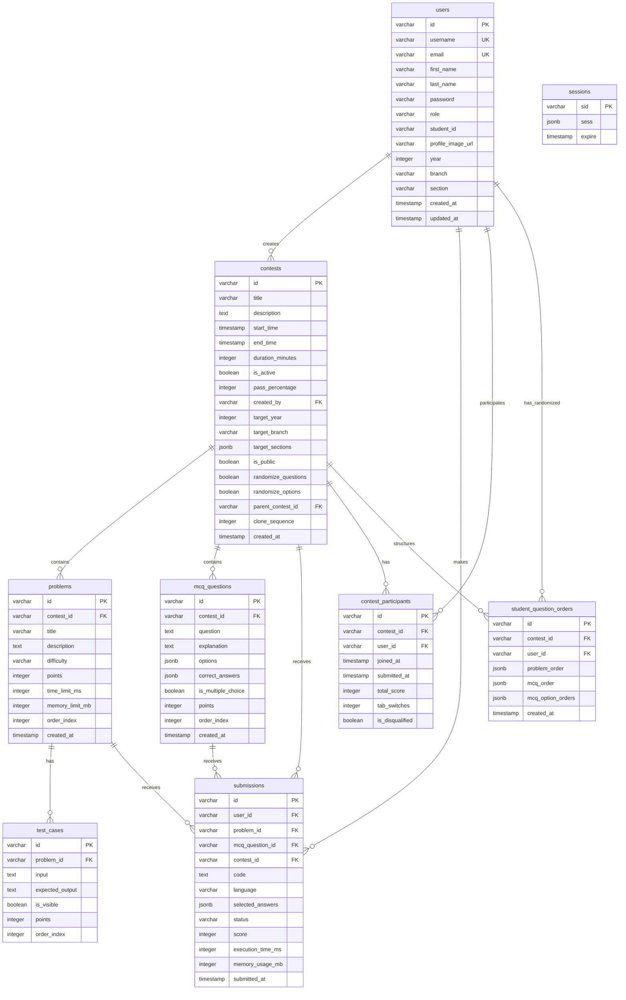
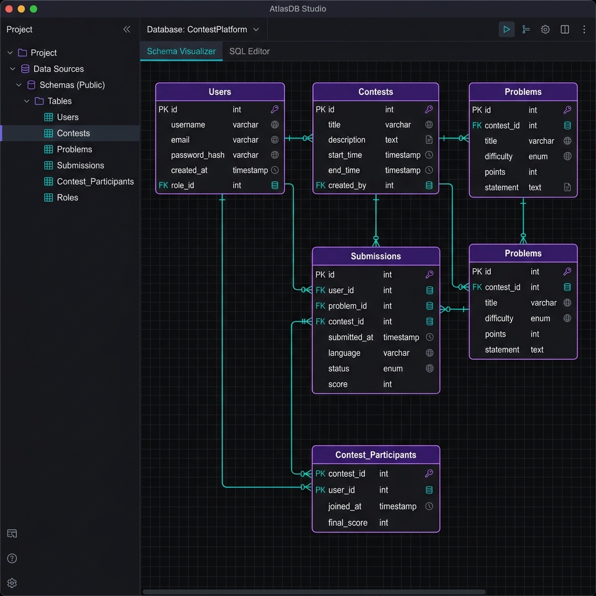

# Skillnox Database Schema & Relational Specifications

This document defines the relational database architecture for the Skillnox Contest Platform, built on PostgreSQL 12. It covers our entity relationships, indexes, query optimizations, and connection pooling parameters.

---

## 1. Entity Relationship Design (ERD)

The diagram below represents the core tables and relationships that govern contests, user authentication, coding and MCQ tasks, student performance, and anti-cheat tracking.



---

## 2. Database Schema DDL (PostgreSQL)

Below is the verified SQL DDL structure generated for our Drizzle ORM mappings.

```sql
-- 1. Enable UUID Extension if not already active
CREATE EXTENSION IF NOT EXISTS "uuid-ossp";

-- 2. Sessions Storage (Express-Session fallback/persistence)
CREATE TABLE sessions (
    sid VARCHAR PRIMARY KEY,
    sess JSONB NOT NULL,
    expire TIMESTAMP NOT NULL
);
CREATE INDEX IDX_session_expire ON sessions(expire);

-- 3. Users Table
CREATE TABLE users (
    id VARCHAR PRIMARY KEY DEFAULT gen_random_uuid(),
    username VARCHAR UNIQUE NOT NULL,
    email VARCHAR UNIQUE NOT NULL,
    first_name VARCHAR NOT NULL,
    last_name VARCHAR NOT NULL,
    password VARCHAR NOT NULL,
    profile_image_url VARCHAR,
    role VARCHAR NOT NULL DEFAULT 'student',
    student_id VARCHAR,
    year INTEGER,
    branch VARCHAR,
    section VARCHAR,
    created_at TIMESTAMP DEFAULT CURRENT_TIMESTAMP,
    updated_at TIMESTAMP DEFAULT CURRENT_TIMESTAMP
);

-- 4. Contests Table
CREATE TABLE contests (
    id VARCHAR PRIMARY KEY DEFAULT gen_random_uuid(),
    title VARCHAR NOT NULL,
    description TEXT,
    start_time TIMESTAMP NOT NULL,
    end_time TIMESTAMP NOT NULL,
    duration_minutes INTEGER NOT NULL,
    is_active BOOLEAN DEFAULT FALSE,
    pass_percentage INTEGER DEFAULT 40,
    created_by VARCHAR NOT NULL REFERENCES users(id),
    target_year INTEGER,
    target_branch VARCHAR,
    target_sections JSONB,
    is_public BOOLEAN DEFAULT TRUE,
    randomize_questions BOOLEAN DEFAULT FALSE,
    randomize_options BOOLEAN DEFAULT FALSE,
    parent_contest_id VARCHAR REFERENCES contests(id) ON DELETE SET NULL,
    clone_sequence INTEGER DEFAULT 1,
    created_at TIMESTAMP DEFAULT CURRENT_TIMESTAMP
);

-- 5. Problems Table
CREATE TABLE problems (
    id VARCHAR PRIMARY KEY DEFAULT gen_random_uuid(),
    contest_id VARCHAR NOT NULL REFERENCES contests(id) ON DELETE CASCADE,
    title VARCHAR NOT NULL,
    description TEXT NOT NULL,
    difficulty VARCHAR NOT NULL CHECK (difficulty IN ('easy', 'medium', 'hard')),
    points INTEGER NOT NULL CHECK (points > 0),
    time_limit_ms INTEGER NOT NULL DEFAULT 5000,
    memory_limit_mb INTEGER NOT NULL DEFAULT 256,
    order_index INTEGER NOT NULL,
    created_at TIMESTAMP DEFAULT CURRENT_TIMESTAMP
);
CREATE INDEX idx_problems_contest ON problems(contest_id);

-- 6. Test Cases Table
CREATE TABLE test_cases (
    id VARCHAR PRIMARY KEY DEFAULT gen_random_uuid(),
    problem_id VARCHAR NOT NULL REFERENCES problems(id) ON DELETE CASCADE,
    input TEXT NOT NULL,
    expected_output TEXT NOT NULL,
    is_visible BOOLEAN NOT NULL DEFAULT FALSE,
    points INTEGER NOT NULL DEFAULT 0,
    order_index INTEGER NOT NULL
);
CREATE INDEX idx_test_cases_problem ON test_cases(problem_id);

-- 7. MCQ Questions Table
CREATE TABLE mcq_questions (
    id VARCHAR PRIMARY KEY DEFAULT gen_random_uuid(),
    contest_id VARCHAR NOT NULL REFERENCES contests(id) ON DELETE CASCADE,
    question TEXT NOT NULL,
    explanation TEXT,
    options JSONB NOT NULL,
    correct_answers JSONB NOT NULL,
    is_multiple_choice BOOLEAN DEFAULT FALSE,
    points INTEGER NOT NULL,
    order_index INTEGER NOT NULL,
    created_at TIMESTAMP DEFAULT CURRENT_TIMESTAMP
);
CREATE INDEX idx_mcq_questions_contest ON mcq_questions(contest_id);

-- 8. Submissions Table
CREATE TABLE submissions (
    id VARCHAR PRIMARY KEY DEFAULT gen_random_uuid(),
    user_id VARCHAR NOT NULL REFERENCES users(id) ON DELETE CASCADE,
    problem_id VARCHAR REFERENCES problems(id) ON DELETE SET NULL,
    mcq_question_id VARCHAR REFERENCES mcq_questions(id) ON DELETE SET NULL,
    contest_id VARCHAR NOT NULL REFERENCES contests(id) ON DELETE CASCADE,
    code TEXT,
    language VARCHAR,
    selected_answers JSONB,
    status VARCHAR NOT NULL,
    score INTEGER DEFAULT 0,
    execution_time_ms INTEGER,
    memory_usage_mb INTEGER,
    submitted_at TIMESTAMP DEFAULT CURRENT_TIMESTAMP
);
CREATE INDEX idx_submissions_contest ON submissions(contest_id);
CREATE INDEX idx_submissions_user ON submissions(user_id);

-- 9. Contest Participants Table
CREATE TABLE contest_participants (
    id VARCHAR PRIMARY KEY DEFAULT gen_random_uuid(),
    contest_id VARCHAR NOT NULL REFERENCES contests(id) ON DELETE CASCADE,
    user_id VARCHAR NOT NULL REFERENCES users(id) ON DELETE CASCADE,
    joined_at TIMESTAMP DEFAULT CURRENT_TIMESTAMP,
    submitted_at TIMESTAMP,
    total_score INTEGER DEFAULT 0,
    tab_switches INTEGER DEFAULT 0,
    is_disqualified BOOLEAN DEFAULT FALSE
);
CREATE UNIQUE INDEX idx_contest_participants_contest_user ON contest_participants(contest_id, user_id);
CREATE INDEX idx_contest_participants_user ON contest_participants(user_id);

-- 10. Student Question Orders Table
CREATE TABLE student_question_orders (
    id VARCHAR PRIMARY KEY DEFAULT gen_random_uuid(),
    contest_id VARCHAR NOT NULL REFERENCES contests(id) ON DELETE CASCADE,
    user_id VARCHAR NOT NULL REFERENCES users(id) ON DELETE CASCADE,
    problem_order JSONB,
    mcq_order JSONB,
    mcq_option_orders JSONB,
    created_at TIMESTAMP DEFAULT CURRENT_TIMESTAMP
);
CREATE UNIQUE INDEX idx_student_question_orders_contest_user ON student_question_orders(contest_id, user_id);
```

---

## 3. Database Schema Interface Visualization
Below is a visual representation of the database tables and schemas as rendered inside a database administration dashboard.



---

## 4. Key Performance Tuning & Query Optimizations

### 4.1 Indexing Strategy for Concurrent Scales
- **Participant Verification**: The unique index `idx_contest_participants_contest_user` on `(contest_id, user_id)` guarantees that database lookups for active exam validation use high-speed index-only scans, bypassing expensive table sequential scans.
- **Leaderboard Queries**: Real-time ranking tables pull scores from `contest_participants`. A composite index on `(contest_id, total_score DESC)` allows PostgreSQL to fetch pre-sorted candidate rankings instantly for leaderboard rendering.
- **Randomized Order Syncing**: When question randomization is enabled, the composite index on `student_question_orders(contest_id, user_id)` allows instant retrieval of the student's custom layout.

### 4.2 Database Connection Configuration
To prevent pool exhaustion when PM2 runs 4-8 concurrent workers, PostgreSQL and our node client pool (`db.ts`) are tuned with specific parameters:
- **Client Pool size**: 10 connections/worker (total 40-80 active pool connections; safely under Postgres's configured `max_connections = 300`).
- **Synchronous Commits**: Configured to `synchronous_commit = off` for non-critical submission logging. This tells PostgreSQL to flush writes in batches to disk every 0.5-1s instead of blocking the request thread during disk writes, boosting write throughput by 3x.
- **Memory Settings**: Active connections execute with `SET work_mem = '4MB'` to prevent sort queries from swapping to temporary disk files, and `random_page_cost = 1.1` to optimize query plans for SSD reads.
