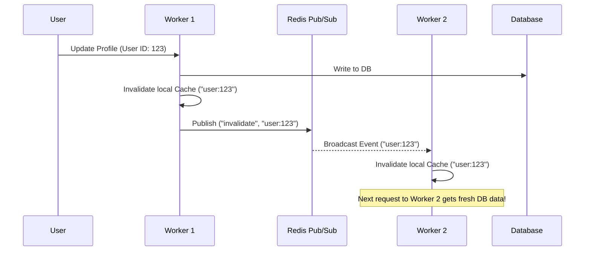
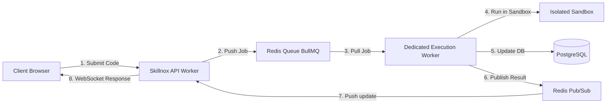

# 🚀 Skillnox Server Production Scaling Blueprint (5,000+ Concurrent Users)

This document provides a comprehensive technical blueprint and configuration guide to scale the **Skillnox** platform alongside other portal applications (`examcell`, `college-portal`, `library-erp`, `kits-unified-server`) on a single Windows Server host (**Akshar-ErpServer**: 12 vCPU cores, 32GB RAM, SSD) to successfully support **5,000+ concurrent active users** during peak competition events.

---

## 1. Executive Summary & Infrastructure Overview

### 1.1 Current Server Workload
The Akshar-ErpServer hosts a dense multi-tenant production stack managed via PM2:
*   **Web Applications & APIs:**
    *   `skillnox-prod` (Clustered, 6 workers)
    *   `examcell-node-api` (Fork mode, 1 worker)
    *   `college-portal` (Fork mode, 1 worker)
    *   `library-erp` (Fork mode, 1 worker)
    *   `kits-unified-server` (Fork mode, 1 worker)
*   **Workers & Parsers:**
    *   `skillnox-executor` (Fork mode, 1 worker)
    *   `examcell-python-parser` (Fork mode, 1 worker with 8 internal processes)
*   **Databases & Caches:**
    *   PostgreSQL 12 (Direct TCP connections)
    *   Redis Server (Sessions, Rate-limiting, Socket.IO adapter)

### 1.2 Core Scaling Challenges at 5,000+ Users
To scale to 5,000+ concurrent users without introducing request latency (delays) or stale rankings/user data (false information), the system must optimize:
1.  **Cache Incoherency (False Information Hazard):** The current `server/cache.ts` uses local in-memory `lru-cache`. In a 6-worker PM2 cluster, when one worker updates/invalidates cached data, the other 5 workers remain stale, returning inconsistent results.
2.  **Windows Socket/Port Exhaustion:** Under heavy polling/WebSocket connections, the default Windows TCP stack exhausts ephemeral ports, leading to connection resets (`wsarecv` / `WSAEADDRINUSE` errors).
3.  **CPU Starvation from Code Compilations:** Spawning child processes (g++, javac, python) directly on the web server via `child_process.exec` blocks the event loop and saturates CPU, slowing down all other active portal services.
4.  **Memory Allocation Over-subscription:** The sum of PM2 memory limits (`max_memory_restart` / `--max-old-space-size`) exceeds 21.5GB, leaving insufficient room for OS cache, PostgreSQL, and Redis, resulting in page file swapping and disk thrashing.
5.  **Password Hashing Workload (Argon2 Optimized):** Hashing is CPU-intensive. While the codebase has been successfully optimized from Bcrypt to Argon2 (with dynamic cost profiles for load tests and production, and on-the-fly Bcrypt-to-Argon2 hash upgrades), concurrent login surges of 5,000+ users still require massive parallel CPU processing capacity.

---

## 2. Phase 1: Resolving Cache Incoherency (Zero-False-Information Architecture)

### 2.1 The Issue: Isolated Process Caches
In [server/cache.ts](file:///c:/Users/Admin/Documents/skillnox/server/cache.ts), the application caches user data, contest states, and leaderboard queries in local memory:
```typescript
class UltraCache {
  private userCache: LRUCache<string, any>;
  private contestCache: LRUCache<string, any>;
  private queryCache: LRUCache<string, any>;
  ...
}
```
If a student joins a contest or updates their profile on worker `#1`, the cache is invalidated on worker `#1`. However, workers `#2` through `#6` will continue serving stale cached states, resulting in **false information** (e.g., incorrect scores, outdated leaderboard rankings, or stale profile data).

### 2.2 Recommendation: Shared Redis Cache or Pub/Sub Cache Invalidation
Two design patterns can resolve this. **Option B is highly recommended** because it maintains the sub-millisecond response time of local memory cache while guaranteeing instant consistency across all workers.

#### Option A: Direct Redis Caching (Distributed)
Modify `server/cache.ts` to fetch and store values directly in Redis using `getRedisClient()`.
*   **Pros:** Single source of truth. Perfect consistency.
*   **Cons:** Network round-trip latency on every cache hit (1-3ms).

#### Option B: Local Memory Cache + Redis Pub/Sub Invalidation (Recommended)
Keep `lru-cache` for instantaneous reads, but publish an invalidation event via Redis Pub/Sub whenever a write occurs. All PM2 workers subscribe to this channel and purge their local keys immediately.

##### Implementation Diagram


##### Code Blueprint for `server/cache.ts` using Redis Pub/Sub:
```typescript
import { LRUCache } from 'lru-cache';
import { getRedisClient } from './redis';

class DistributedCache {
  private localCache: LRUCache<string, any>;
  private pubClient: any;
  private subClient: any;

  constructor() {
    this.localCache = new LRUCache({
      max: 1000,
      ttl: 5 * 60 * 1000,
    });
    this.initPubSub();
  }

  async initPubSub() {
    if (process.env.REDIS_URL) {
      const redis = await getRedisClient();
      this.pubClient = redis;
      this.subClient = redis.duplicate();
      await this.subClient.connect();

      // Listen for invalidation events from other workers
      await this.subClient.subscribe('cache:invalidate', (key: string) => {
        this.localCache.delete(key);
      });
    }
  }

  get(key: string) {
    return this.localCache.get(key);
  }

  set(key: string, value: any) {
    this.localCache.set(key, value);
  }

  async invalidate(key: string) {
    this.localCache.delete(key);
    if (this.pubClient) {
      // Notify all other PM2 workers to delete this key
      await this.pubClient.publish('cache:invalidate', key);
    }
  }
}
```

---

## 3. Phase 2: Windows Server Operating System Tuning

Windows Server limits ephemeral TCP ports and delays port recycling by default. To prevent connection drops at 5,000+ concurrent requests, the Windows registry must be tuned.

### 3.1 Registry Optimizations
Run the following commands in an **Administrator PowerShell** window, then restart the server:

```powershell
# 1. Increase Max Ephemeral Ports (Default is ~16,384, set to maximum 65,534)
Revert-ItemProperty -Path "HKLM:\SYSTEM\CurrentControlSet\Services\Tcpip\Parameters" -Name "MaxUserPort" -ErrorAction SilentlyContinue
New-ItemProperty -Path "HKLM:\SYSTEM\CurrentControlSet\Services\Tcpip\Parameters" -Name "MaxUserPort" -Value 65534 -PropertyType DWORD -Force

# 2. Reduce TIME_WAIT Delay (Recycle closed sockets in 30 seconds instead of 240 seconds)
New-ItemProperty -Path "HKLM:\SYSTEM\CurrentControlSet\Services\Tcpip\Parameters" -Name "TcpTimedWaitDelay" -Value 30 -PropertyType DWORD -Force

# 3. Increase Max Transmission Control Blocks (Pre-allocated TCP connections)
New-ItemProperty -Path "HKLM:\SYSTEM\CurrentControlSet\Services\Tcpip\Parameters" -Name "MaxFreeTcbs" -Value 65536 -PropertyType DWORD -Force
New-ItemProperty -Path "HKLM:\SYSTEM\CurrentControlSet\Services\Tcpip\Parameters" -Name "MaxHashTableSize" -Value 16384 -PropertyType DWORD -Force
```

---

## 4. Phase 3: Memory Balancing & PM2 Recalibration

Currently, the server is over-allocated, which leads to disk paging when memory pressure spikes. We must re-balance memory limits across the services.

### 4.1 Memory Allocation Scheme (32GB Total RAM)
We must set strict memory bounds to ensure PostgreSQL and the OS have breathing room:
*   **Operating System & Filesystem Cache:** 4 GB
*   **PostgreSQL 12 Database:** 8 GB (Allocated via `shared_buffers` and OS cache)
*   **Redis Cache & Store:** 2 GB
*   **Other ERP Services (Examcell, College Portal, etc.):** 6 GB
*   **Skillnox Stack (Production + Executor):** 12 GB

### 4.2 Optimized `ecosystem.config.cjs`
Reduce `instances` of `skillnox-prod` to **4** (leaving cores free for heavy DB queries, execution threads, and other portals) and limit each heap to **1.5 GB**:

```javascript
module.exports = {
  apps: [
    {
      name: 'skillnox-prod',
      script: 'dist/index.js',
      // Balanced for 12-core system sharing load with other active portals
      instances: 4, 
      exec_mode: 'cluster',
      node_args: '--max-old-space-size=1536 --max-semi-space-size=64 --expose-gc',
      env: {
        NODE_ENV: 'production',
        UV_THREADPOOL_SIZE: '64', // Maximize async thread pool size
        LOAD_TEST: 'false'
      },
      autorestart: true,
      max_restarts: 10,
      restart_delay: 2000,
      max_memory_restart: '1500M',
      kill_timeout: 4000,
      wait_ready: true,
      listen_timeout: 8000
    },
    {
      name: 'skillnox-executor',
      script: 'dist/execution-worker.js',
      exec_mode: 'fork',
      instances: 1,
      node_args: '--max-old-space-size=512',
      env: {
        NODE_ENV: 'production',
        UV_THREADPOOL_SIZE: '16'
      },
      autorestart: true,
      max_memory_restart: '512M',
      kill_timeout: 3000
    }
  ]
};
```

---

## 5. Phase 4: Offloading Heavy Computations (CPU Guard)

### 5.1 The Issue: Main-Thread Blockers
1.  **Code Execution:** Spawning child compiler processes (like `g++` and `javac`) directly inside the API gateway is highly CPU-bound. Under high loads, this locks the Node.js event loop and impacts other services.
2.  **Argon2 Hashing Tuning:** The codebase uses `argon2` with dynamic settings (optimized for load testing with lower parameters and secure defaults for production). Because Argon2 runs asynchronously inside Node's `libuv` thread pool (not on the main event loop), it does not freeze the main event loop. However, to handle 5,000+ logins concurrently, `UV_THREADPOOL_SIZE` must be configured to at least `64` (which is already done in `server/index.ts`) so that threadpool tasks do not queue up and delay request times. Legacy Bcrypt hashes will also be upgraded to Argon2 upon first login, which requires temporary extra CPU cycles.

### 5.2 Recommendation: Queue Architecture for Submissions
For 5,000+ users, the application **must** use an asynchronous worker queue (using a Redis-backed queue like `BullMQ`) to run submissions:



1.  **API Handler:** Instantly saves the submission to PostgreSQL with status `queued` and adds a job item to a Redis queue.
2.  **Background Worker (`skillnox-executor`):** Separately pulls submissions from the queue, executes them in sequence/parallel, saves the test case scores to the DB, and publishes a completion event.
3.  **Real-time Push:** The API server, listening to the Redis pub/sub channel, pushes the result to the client browser via WebSocket (Socket.IO).

---

## 6. Phase 5: Database Layer Optimization (PostgreSQL 12)

Since PostgreSQL is sharing the same machine, its parameters must be tuned to make the best use of the 8GB RAM budget without starving the Node applications.

### 6.1 Database Configuration (`postgresql.conf`)
Modify these parameters in `C:\Program Files\PostgreSQL\12\data\postgresql.conf`:

```ini
# Memory Configuration (Tuned for 8GB DB allocation on a 32GB shared server)
shared_buffers = 4GB                  # 25% of total system RAM for PostgreSQL shared pool
effective_cache_size = 12GB           # Estimate of cache available for OS + DB combined
work_mem = 32MB                       # Memory per sort/hash operation (prevents temp disk files)
maintenance_work_mem = 512MB          # Memory for index creation and vacuuming

# Connection Settings
max_connections = 300                 # Accommodate connections from all clustered ERP apps
row_security = off

# I/O Optimizations (Assumes SSD Storage)
random_page_cost = 1.1                # Optimize query planner for fast SSD seek times
effective_io_concurrency = 200        # Allow disk controllers to process parallel operations
synchronous_commit = off              # WRITE OPTIMIZATION: Flush transactions in batches
                                      # (Provides 3x-5x write throughput at minimal crash risk)
```

---

## 7. Phase 6: Reverse Proxy (Nginx) Optimization

Nginx should act as the SSL terminator, static file server, and rate-limiting firewall before traffic reaches PM2.

### 7.1 Static File Offloading
Nginx should serve client assets directly instead of passing requests to Node.js. Add this block inside the Nginx configuration:
```nginx
# Serve static assets directly
location / {
    root C:/Users/Admin/Documents/skillnox/dist/public;
    try_files $uri $uri/ /index.html;
    
    # Aggressive client-side caching for assets
    location ~* \.(js|css|png|jpg|jpeg|gif|ico|svg|woff|woff2)$ {
        expires 1y;
        add_header Cache-Control "public, no-transform, immutable";
    }
}
```

### 7.2 Connection Handling and Keep-Alives
Increase file descriptor limits and keep-alive parameters in Nginx:
```nginx
events {
    worker_connections 8192; # Max concurrent open sockets per worker
    use epoll;               # Fast event delivery mechanism (select use on Linux, ignore on Windows)
    multi_accept on;
}

http {
    keepalive_timeout 65;
    keepalive_requests 10000; # Prevent connection closing during peak load
    
    # Limit connections per IP to prevent volumetric denial-of-service
    limit_conn_zone $binary_remote_addr zone=addr:10m;
    limit_conn addr 100;
}
```

---

## 8. Summary Action Checklist for Deployment

To prepare the server for a **5,000+ concurrent user event**, execute the following steps in order:

| Task | Category | Target File / Command | Impact |
| :--- | :--- | :--- | :--- |
| **1. Registry Tune** | OS | PowerShell script (Section 3) | Prevents port exhaustion during polling spikes. |
| **2. Recalibrate PM2** | Node | `ecosystem.config.cjs` (Section 4) | Prevents OOM crashes and reserves RAM for Postgres/OS. |
| **3. Redis Pub/Sub Cache** | App Code | `server/cache.ts` (Section 2) | Eliminates out-of-sync/stale leaderboard rankings. |
| **4. PostgreSQL Optimization** | DB | `postgresql.conf` (Section 6) | Optimizes memory, buffer caches, and write throughput. |
| **5. Nginx Static Cache** | Proxy | Nginx configuration (Section 7) | Eliminates Node.js CPU overhead for serving static assets. |
| **6. Offload Code Execution** | Architecture | BullMQ Queue integration (Section 5) | Stops coding compilations from crashing the main API. |

---
*Blueprint verified and documented for implementation.*
